# Segmentation and Anatomical Annotation of Cerebral Arteries in Non-Angiographic MRI

<mark>Notice: Our latest contributions on the topic are available through our new repository at [GitHub](https://github.com/risc-mi/cerebral-artery-segmentation).</mark>

<table><tbody style="border-color: black;text-align: center;background-color: black;">
<tr>
<td>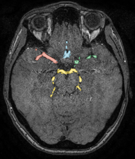</td>
<td>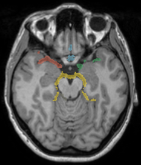</td>
<td>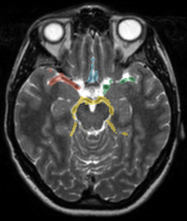</td>
<td>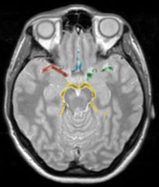</td>
</tr>
<tr style="font-family: Serif;color: white">
<td style="width:200px">TOF-MRA</td>
<td style="width:200px">PDw</td>
<td style="width:200px">T1w</td>
<td style="width:200px">T2w</td>
</tr>
</tbody></table>

## About
This repository contains data and models to reproduce the results of the 2023 publication "Segmentation and Anatomical Annotation of Cerebral Arteries in Non-Angiographic MRI" ([full Reference](#references)).
Our trained models can be used with the [nnU-Net Framework](https://github.com/MIC-DKFZ/nnUNet) to predict anatomical label for new data.

The models have been trained to predict arterial vessels around the Circle-of-Willis (CoW) for angiographic **and non-angiographic** MRI.
The dataset contained TOF-MRA, T1w, T2w and PDw scans, but the models generated reasonable predictions for different modalities as well (e.g., T1w MPRAGE MRA).
The models have been trained on all four modalities in a 5-fold cross validation, which is why no specific model needs to be selected for a given modality. 
During inference, you may also choose to predict using a single model from one fold only. Our recommendation (and the default configuration during inference) is to use all folds
in an ensemble.

Please refer to our [publication](#references) if you are interested in the details, e.g., how the ground-truth annotations have been generated.


<table><tbody style="text-align: center;background-color:white;vertical-align: top">
<tr>
<td>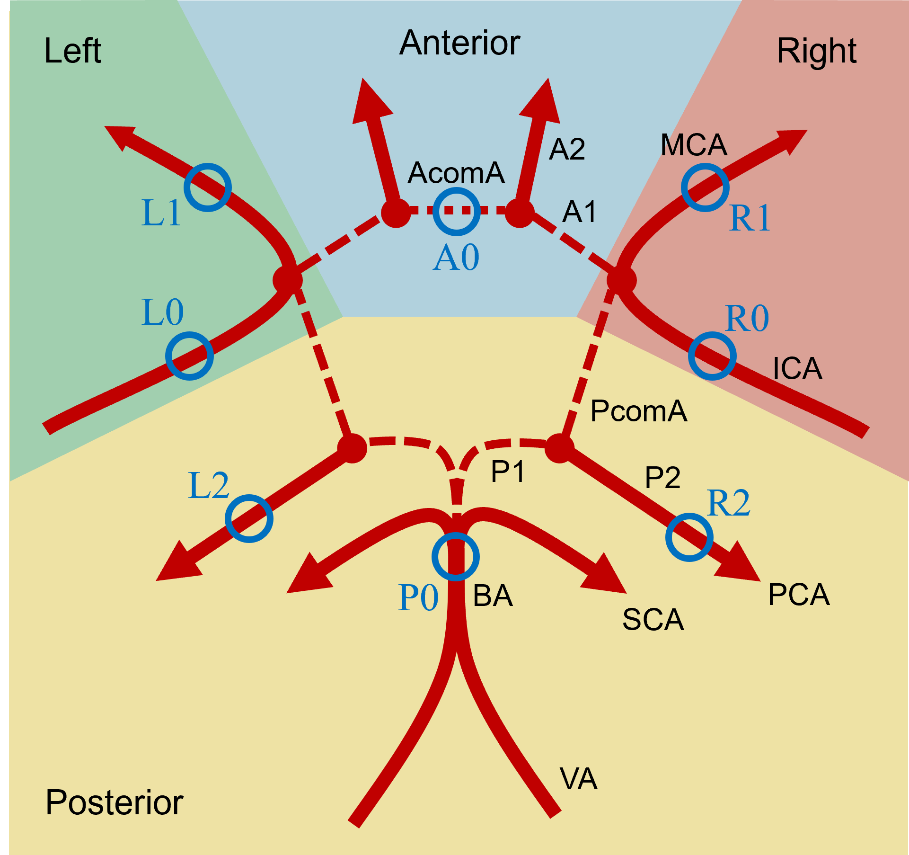</td>
<td>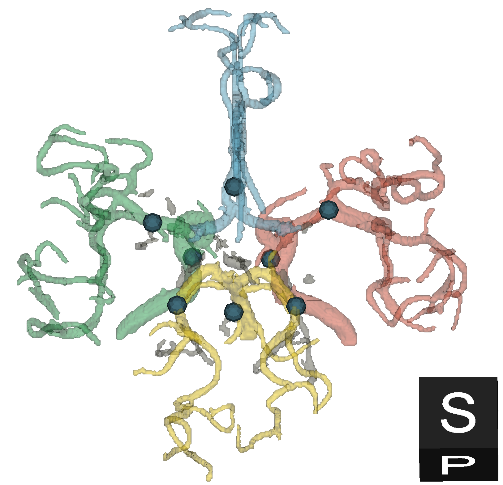</td>
</tr>
<tr style="color:black;font-family: Serif">
<td style="width:600px">
(a)<br>Anatomical outline of the Circle-of-Willis (CoW): Arterial vessels and their flow directions are indicated through red lines, and abbreviations of the
respective vessel segments are shown (e.g., ICA, MCA, PCA, ...). Segments which may not be present in every patient are shown as dashed lines.
Marker points used for the Ground-Truth generation algorithm are shown in blue.
The resulting four circulatory regions (Left, Right, Anterior, Posterior) are labeled and their borders indicated in the background colors.</td>
<td style="width:350px">
(b)<br>Exemplar ground-truth annotation for IXI002: circulatory regions and marker points match the anatomical outline described in (a).
</tr>
</tbody></table>

<table><tbody style="text-align: center;background-color:white;vertical-align: top">
<tr>
<td>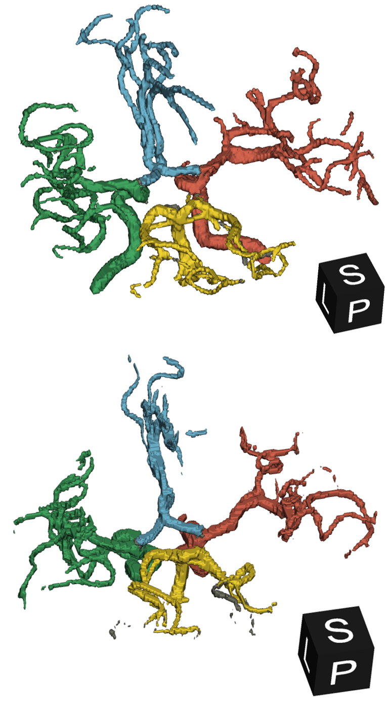</td>
<td>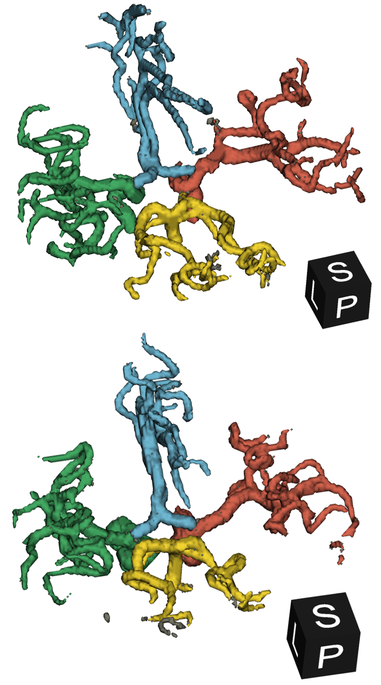</td>
<td>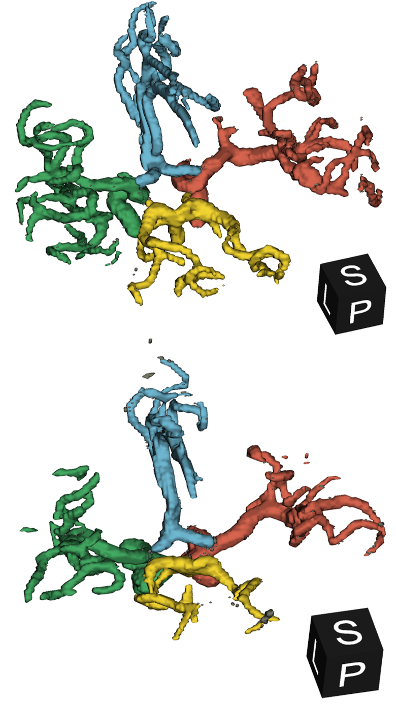</td>
<td>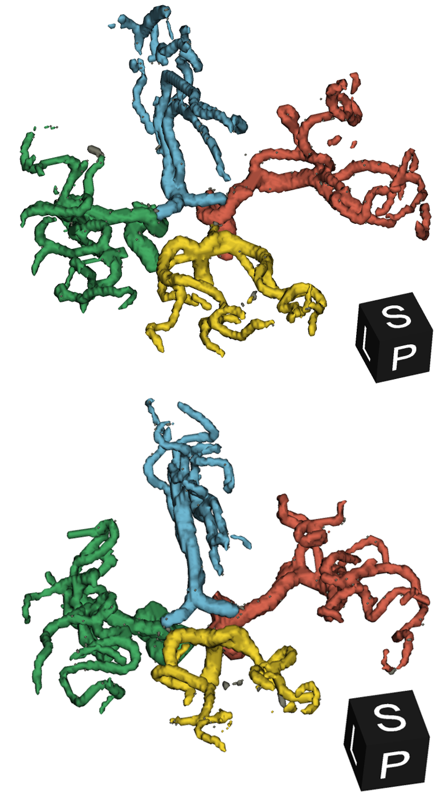</td>
</tr>
<tr style="color:black;font-family: Serif">
<td style="width:200px">TOF-MRA</td>
<td style="width:200px">PDw</td>
<td style="width:200px">T1w</td>
<td style="width:200px">T2w</td>
<tr style="color:black;font-family: Serif">
<td colspan="4">Predictions for IXI002 of the cross-validation split (top) and IXI347 of the test-split (bottom).</td>
</tr>
</tbody></table>

## How to use

### Prerequisites

Our work fully relies on the nnU-Net framework for training and inference. You can
checkout their [Github](https://github.com/MIC-DKFZ/nnUNet) repository or install the package from [PyPI](https://pypi.org/project/nnunetv2/):
```pip install nnunetv2```. However, be careful to set up Pytorch correctly for your system before installing nnU-Net. 
For more information, check the [training.ipynb](notebooks/training.ipynb) and the [nnU-Net Instructions](https://github.com/MIC-DKFZ/nnUNet/blob/master/documentation/installation_instructions.md).

### Training

We provide our nnU-Net compatible dataset, named ```Dataset600_IXI```, used for training our models in the subfolder [data](data).
To reduce the size of the repository, all data derived from the IXI dataset has been omitted and needs to be downloaded separately.
The IXI dataset is publicly available at [brain-development.org](https://brain-development.org/ixi-dataset/). 
Follow the instructions at [prepare.ipynb](notebooks/prepare.ipynb) to easily reconstruct the full dataset.
With the reconstructed dataset you can subsequently train models using the nnU-Net Framework as described in [training.ipynb](notebooks/training.ipynb).


### Inference

We provide pretrained models for our dataset at [Google Drive](https://drive.google.com/drive/folders/1-AJ6OdFb3IqR4gnbwxh9NmxJ46gzsVPL?usp=drive_link).
Follow the instructions at [inference.ipynb](notebooks/inference.ipynb) to use our models with the nnU-Net framework and generate predictions for your data.

The output labels predicted by our models are as follows:

<table><tbody style="text-align: center;background-color:white;vertical-align: center">
<tr><td>
<table><tbody style="text-align: center;background-color:lightgray;vertical-align: top">
<tr style="color:black"><td style="width:30px;background-color:black"></td><td>0</td><td>Background</td></tr>
<tr style="color:black"><td style="width:30px;background-color:#7a7a6c"></td><td>1</td><td>(unspecific) Vessel</td></tr>
<tr style="color:black"><td style="width:30px;background-color:#f4d631"></td><td>2</td><td>Posterior</td></tr>
<tr style="color:black"><td style="width:30px;background-color:#6fb8d2"></td><td>3</td><td>Anterior</td></tr>
<tr style="color:black"><td style="width:30px;background-color:#44ac64"></td><td>4</td><td>Left</td></tr>
<tr style="color:black"><td style="width:30px;background-color:#d8654f"></td><td>5</td><td>Right</td></tr>
</tbody></table>
</td>
<td>
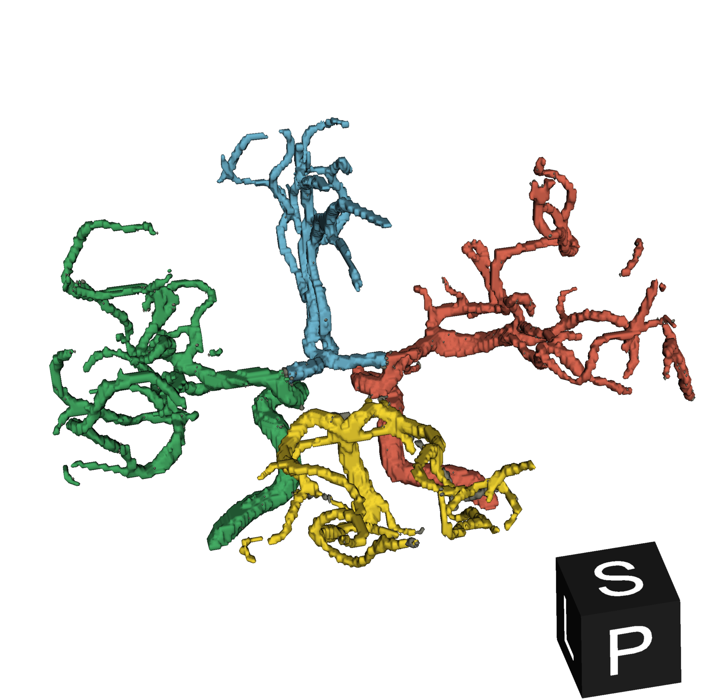
</td>
</tr></tbody></table>

## References

Our paper will be published at the proceedings of the DMIP conference at [ACM](https://dl.acm.org/conference/dmip).
We also share the accepted version of our [paper](accepted-paper.pdf).

If you use our results in your research, we would appreciate you citing the following conference paper:

* B. Sabrowsky-Hirsch, P. Moser, S. Thumfart and J. Scharinger. Segmentation and Anatomical Annotation of Cerebral Arteries in Non-Angiographic MRI. In: Proceedings of the 2023 6th International Conference on Digital Medicine and Image Processing. 2023.

```
@inproceedings{SabrowskyCerebral2023,
  author = {Bertram Sabrowsky-Hirsch, Philipp Moser, Stefan Thumfart and Josef Scharinger},
  title = { Segmentation and Anatomical Annotation of Cerebral Arteries in Non-Angiographic MRI},
  booktitle = {Proceedings of the 2023 6th International Conference on Digital Medicine and Image Processing},
  month = nov,
  year = 2023,
  publisher = {Association for Computing Machinery},
  isbn = {979-8-4007-0942-5}
}
```

## Contact

If you have any inquiries, please open a GitHub issue.

## Acknowledgements

<div style="background-color:white;padding: 1em">


</div>

This project is financed by research subsidies granted by the government of Upper Austria. RISC Software GmbH is Member of UAR (Upper Austrian Research) Innovation Network.
